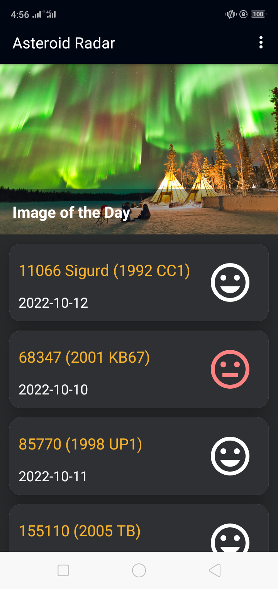
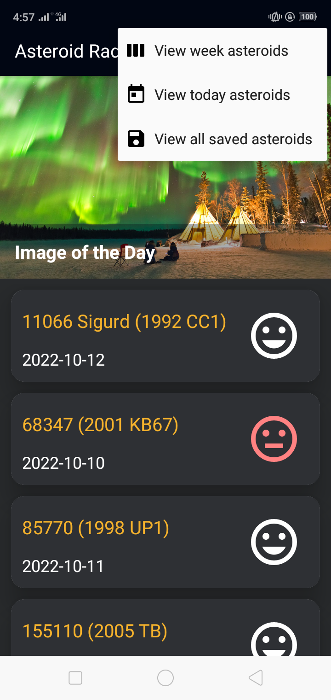
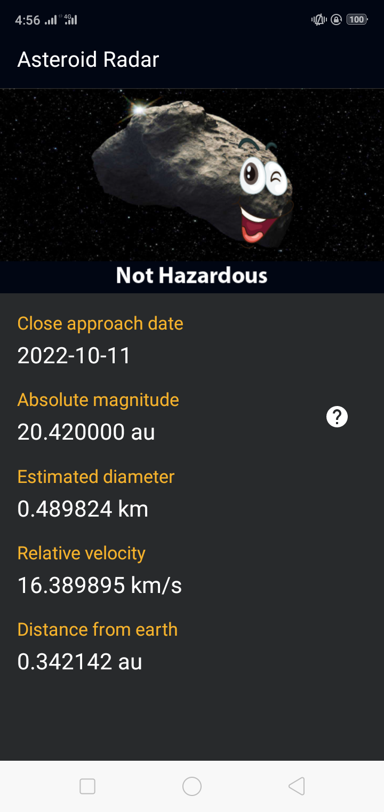
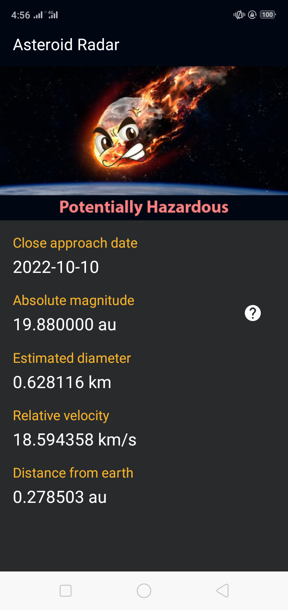
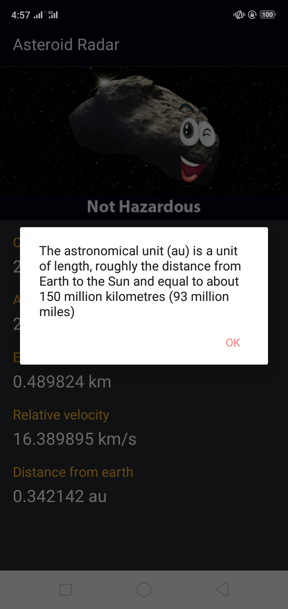

# Asteroid Radar App

Asteroid Radar is an app to view the asteroids detected by NASA that pass near Earth, you can view
all the detected asteroids in a period of time, their data (Size, velocity, distance to Earth) and
if they are potentially hazardous.

## App's Overview
The app consists of two screens:
- A Main screen with a list of all the detected asteroids
- A Details screen that displays the NASA image of the day and the detailed information about the
  asteroid once it´s selected in the Main screen. The main screen also shows the NASA image of the
  day to make the app more striking.
- Includes the Main screen with a list of clickable asteroids
- Includes a Details screen that displays the selected asteroid data
- Downloads and parses data from the NASA NeoWS API.
- Once an asteroid is saved in the database, the list of asteroids is displayed
- The asteroids data is cached by using a worker, so it downloads and saves week asteroids in
  background.

## Jetpack Components

The following components from the Jetpack library are used:

- Navigation Component
- Room Database
- ViewModel, LiveData and Data Binding

## Important Dependencies & Features

Some important dependencies and features used are:

- Coroutines for getting off the UI thread
- WorkManager for running predictor tasks in the background
- MutableStateFlow
- GSON Library - A library to serialize and deserialize Java objects to JSON
- Retrofit with Moshi + Scalars Converters to download and convert the data from the Internet.
- Moshi to convert the JSON data we are downloading to usable data in form of custom classes.
- Glide - An image loading and caching library
- CardView, RecyclerView to display the asteroids in a list.
- Secrets Gradle Plugin for Android - A Gradle plugin for providing your secrets securely to your
  Android project.

## Built With
* [Android Studio](https://developer.android.com/studio) - Default IDE used to build android apps
* [Kotlin](https://kotlinlang.org/) - Default language used to build this project
* [Navigation Component](https://developer.android.com/guide/navigation/navigation-getting-started)
    - Android Jetpack's Navigation component, used for Fragment-based navigation
* [Retrofit](https://github.com/square/retrofit) - a type-safe HTTP client for Android and Java
* [Moshi](https://github.com/square/moshi) - a modern JSON library for Android and Java, that makes
  it easy to parse JSON into Java or Kotlin objects
* [Picasso](https://square.github.io/picasso) - a powerful image downloading and caching library for
  Android
* [Android Architecture Components](https://developer.android.com/topic/libraries/architecture) - a
  collection of libraries that help design robust, testable, and maintainable apps: Room (a SQLite
  object mapping library), LiveData (builds data objects that notify views when the underlying
  database changes), ViewModel (stores UI-related data that isn't destroyed on app rotations)
* [Data Binding](https://developer.android.com/topic/libraries/data-binding) - a Jetpack support
  library that allows to bind UI components in your layouts to data sources in your app using a
  declarative format rather than programmatically
* [MVVM](https://developer.android.com/jetpack/guide) - the architecture pattern used in the app (
  Model-View-ViewModel), that incorporates the Android Architecture Components

## Screenshots

### List of Daily / Weekly or Offline Asteroid Records

### Filter Menus

### Detail Fragment: Asteroid with safe Status

### Detail Fragment: Asteroid with Hazard Status

### Custom Dialog to display information about Astronomical Unit (au)

